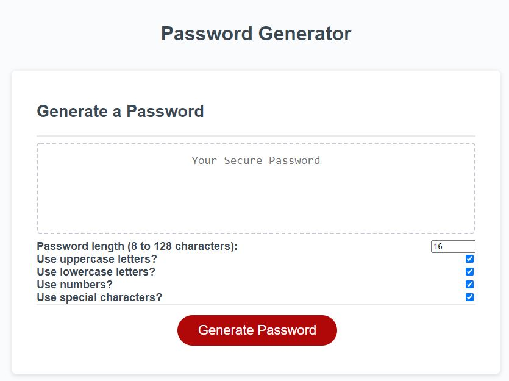

# Password Generator

## Description

This web application generates a secure password for the end user.

The user can choose the below criteria for their password:

* The length of the password (8 to 128 characters).

* Whether or not to include uppercase letters in the password.

* Whether or not to include lowercase letters in the password.

* Whether or not to include numbers in the password.

* Whether or not to include special characters in the password.

## Usage

To use the application, simply enter the number of characters you want to have in your password by typing it in, clicking the up/down arrows on the right side of the textbox, or pressing the up and down arrows on your keyboard to go up or down 1 number.

Then, verify the criteria you desire for your password.

By default, all of the boxes are checked.

If you don't want your password to contain special characters (such as !%*#@ and so on) you can uncheck the box next to the "Use special characters?" label. 

You may repeat this process for any other criteria you would like to omit for your password.

Then, simply click the red Generate Password button, and the placeholder text (Your Secure Password) in the textarea element will be replaced by your generated password.

## Website

Try out the finished application here:

[Password Generator](https://mikeh138.github.io/password-generator/)

## Code of Conduct

  

## License

&copy; 2020 Mike Henson  

Licensed under the [MIT](LICENSE.txt) license.